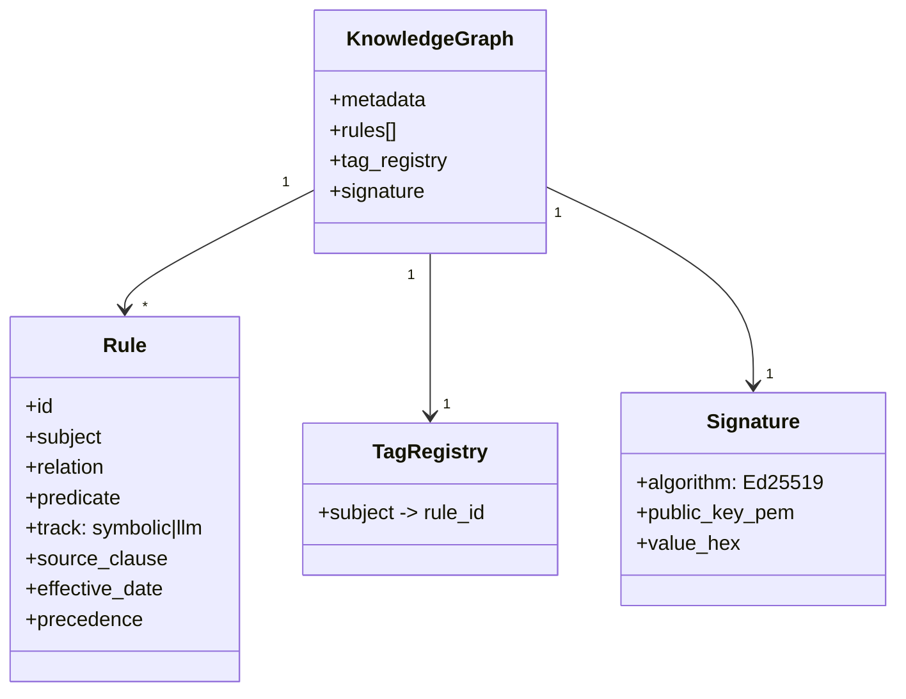
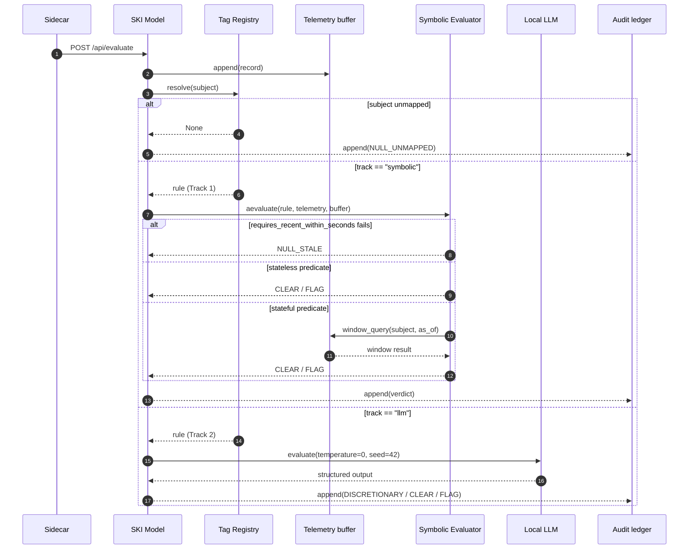
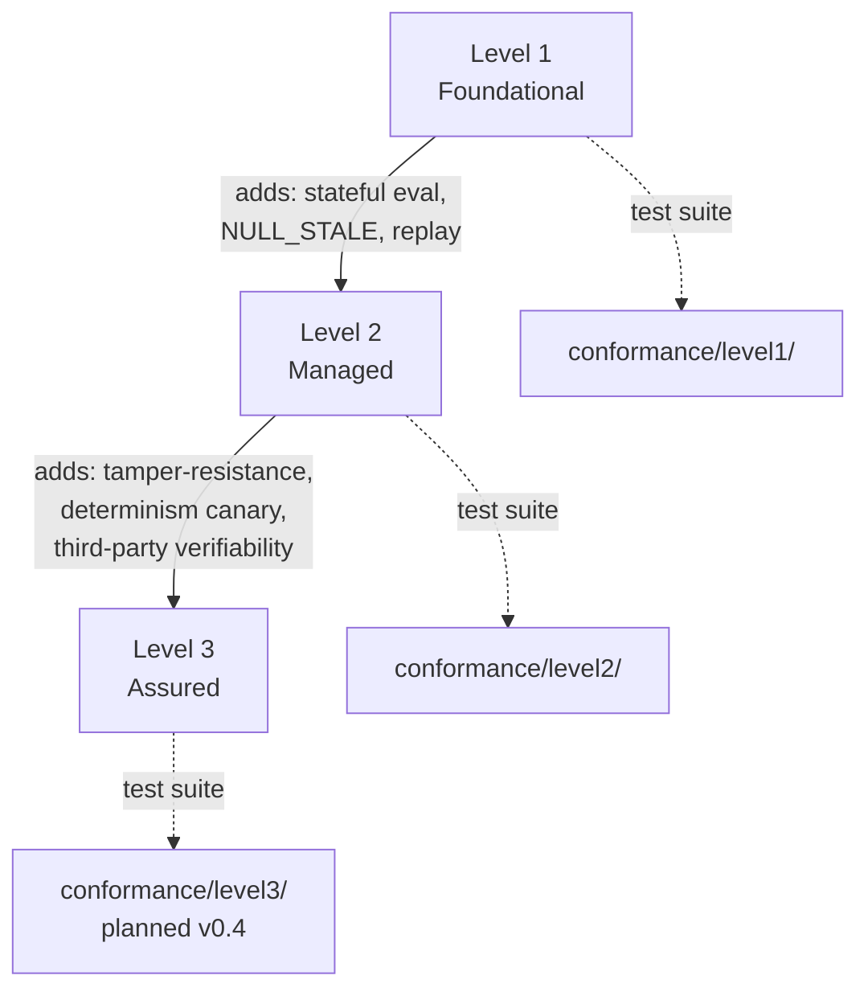

# Architecture

SKI v2.1 is built around a **two-phase architecture**. Phase 1 (offline,
probabilistic) compiles regulations into a signed Knowledge Graph.
Phase 2 (runtime, deterministic) evaluates telemetry against that graph
inside the operator's sovereignty boundary.

## High-level dataflow

```mermaid
flowchart LR
    subgraph P1["Phase 1 — Compilation (outside sovereign boundary)"]
        Reg[Regulatory<br/>documents]
        Ext[kg-extractor<br/><i>(LLM-assisted)</i>]
        Val[kg-validator<br/><i>(human review)</i>]
        KG[(Signed<br/>Knowledge Graph)]
        Reg --> Ext --> Val --> KG
    end

    subgraph P2["Phase 2 — Runtime (inside sovereign boundary)"]
        Tel[Telemetry<br/><i>(SCADA, sensors, ETL)</i>]
        SC[Sidecar]
        SM[SKI Model service]
        TR{{Tag Registry}}
        SE[Symbolic Evaluator<br/><b>Track 1</b>]
        LL[Local LLM<br/><b>Track 2</b><br/><i>(Ollama)</i>]
        TB[(Telemetry buffer)]
        AL[(Audit ledger)]
        V((Verdict))

        Tel --> SC --> SM
        SM --> TR
        TR -->|symbolic| SE
        TR -->|llm| LL
        SE --> V
        LL --> V
        SM --> TB
        V --> AL
    end

    KG -. one-way<br/>signed transfer .-> SM

    classDef boundary fill:#f9f9f9,stroke:#666,stroke-dasharray: 5 5;
    class P1,P2 boundary;
```

The dashed arrow is the **only** thing that crosses the boundary: a
signed KG file. No operational data ever moves the other way.

## Component breakdown

### Phase 1 — Compilation

#### kg-extractor

Reads regulatory documents (Clean Air Act, MiFID, GDPR, etc.) and
emits structured rule candidates. Uses an LLM backend (configurable —
not bound to any vendor). Output is **never** trusted directly; every
rule is reviewed in the next step.

#### kg-validator

Human-in-the-loop validation. Detects:

- **duplicates** (same subject + relation + object),
- **contradictions** (same subject + relation, different numeric
  thresholds — see [v0.2.1 fix](CHANGELOG.md#021---2026-05-25)),
- **date overlaps**.

Outputs an approved-rule list. EXPLICIT and DISCRETIONARY rules both
require human approval; auto-approval was removed in v2.1.

#### Knowledge Graph

The compiled artifact. Contains:



### Phase 2 — Runtime

#### Sidecar

Passive, read-only telemetry intake. Reads from `file`, `http`, or
`kafka` (selected via `TELEMETRY_SOURCE`). Forwards normalised records
to the SKI Model service over mTLS. **Does not perform tag inference**
— routing is the runtime's job.

Rejects any incoming record that carries a `rule_id` field (B4.3).

#### SKI Model service

The runtime's core. Receives a telemetry record and:



Key invariants:

- **One worker.** `SKI_MODEL_WORKERS=1` is enforced. Concurrent writes
  to the buffer + ledger would break the sequence-number monotonicity
  guarantee. See [`docs/CONCURRENCY.md`](https://github.com/kpifinity/ski-framework/blob/main/reference-implementation/docs/CONCURRENCY.md).
- **Buffer-before-evaluate.** The current record is written to the
  buffer **before** the Symbolic Evaluator runs, so self-referential
  window queries see the record they're being asked about.
- **Authoritative clock.** The telemetry's `timestamp` is the "now"
  for stateful predicates. Wall-clock at arrival is never consulted.
  This is what makes replay deterministic.

#### Telemetry buffer

Postgres-backed, RANGE-partitioned by `telemetry_ts`. Append-only at
the database layer (same trigger pattern as the ledger). Retention is
configured per tenant in the `tenants` table — no default; the
operator must set it explicitly.

See [RFC 0001](RFCs/0001-stateful-evaluation.md) for the design
rationale.

#### Symbolic Evaluator

Pure async function from `(rule, telemetry, buffer, as_of)` to
`SymbolicDecision`. No LLM involved. Operators are limited to the
predicate grammar:

- **Stateless**: `lte`, `lt`, `gte`, `gt`, `eq`, `range`, `between`,
  `in_set`, `not_in_set`, `exists`.
- **Stateful** (v0.2+): `window_count`, `window_sum`, `window_avg`,
  `since_last`, `debounce`.
- **Freshness gate**: `requires_recent_within_seconds` (any operator).

Any rule needing natural-language interpretation must be declared
`track: "llm"` instead and routes through the LLM wrapper. The
Symbolic Evaluator refuses to guess.

#### Audit ledger

Append-only Postgres table. Each row contains:

- `sequence_number` (monotonic, unique),
- `telemetry_hash` (SHA-256 of canonical telemetry record — joins to
  buffer rows),
- `entry_hash` (SHA-256 over the canonical entry payload, chained
  to `previous_entry_hash`),
- `verdict`, `rule_id`, `reasoning`, `track`,
- `knowledge_graph_version`, `schema_version`,
- `recorded_at`.

UPDATE / DELETE / TRUNCATE are blocked by triggers. The canonical
serialization is documented in `tools/audit-ledger/src/audit_ledger/canonical.py`
so any third party can re-verify.

## Conformance levels



The conformance test suite is the **executable specification**. See
[Conformance](conformance.md).

## Threat model

See [Threat model](threat-model.md) for the complete list of in-scope
threats, defences, and out-of-scope concerns.

## Related documents

- [RFC 0001 — Stateful evaluation](RFCs/0001-stateful-evaluation.md)
- [Knowledge Graph schema](knowledge-graph.md)
- [Replay primitive](replay.md)
- [Migrations](migrations.md)
- [Glossary](glossary.md)
