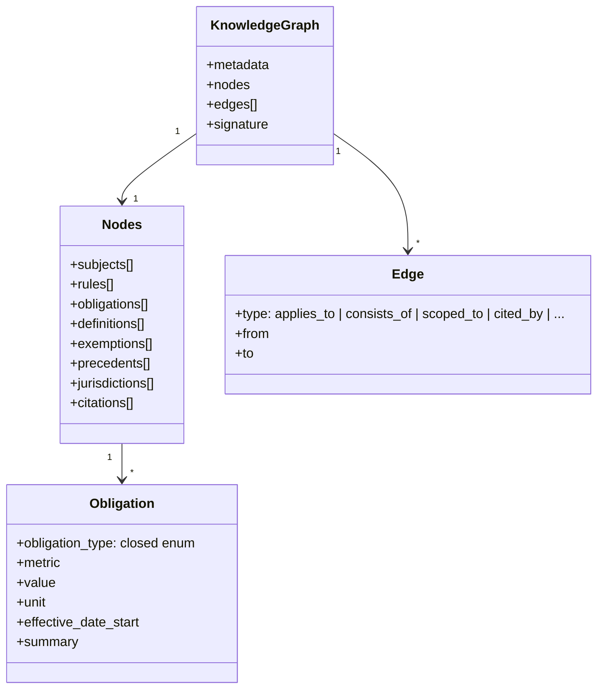
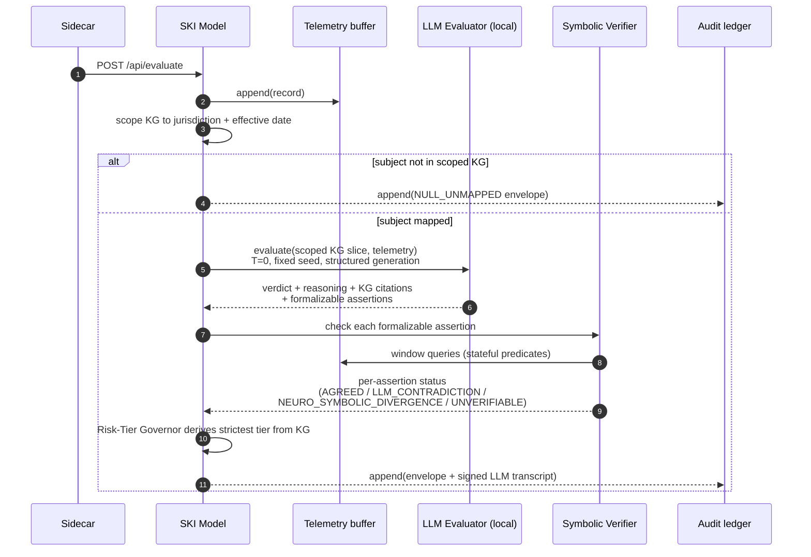
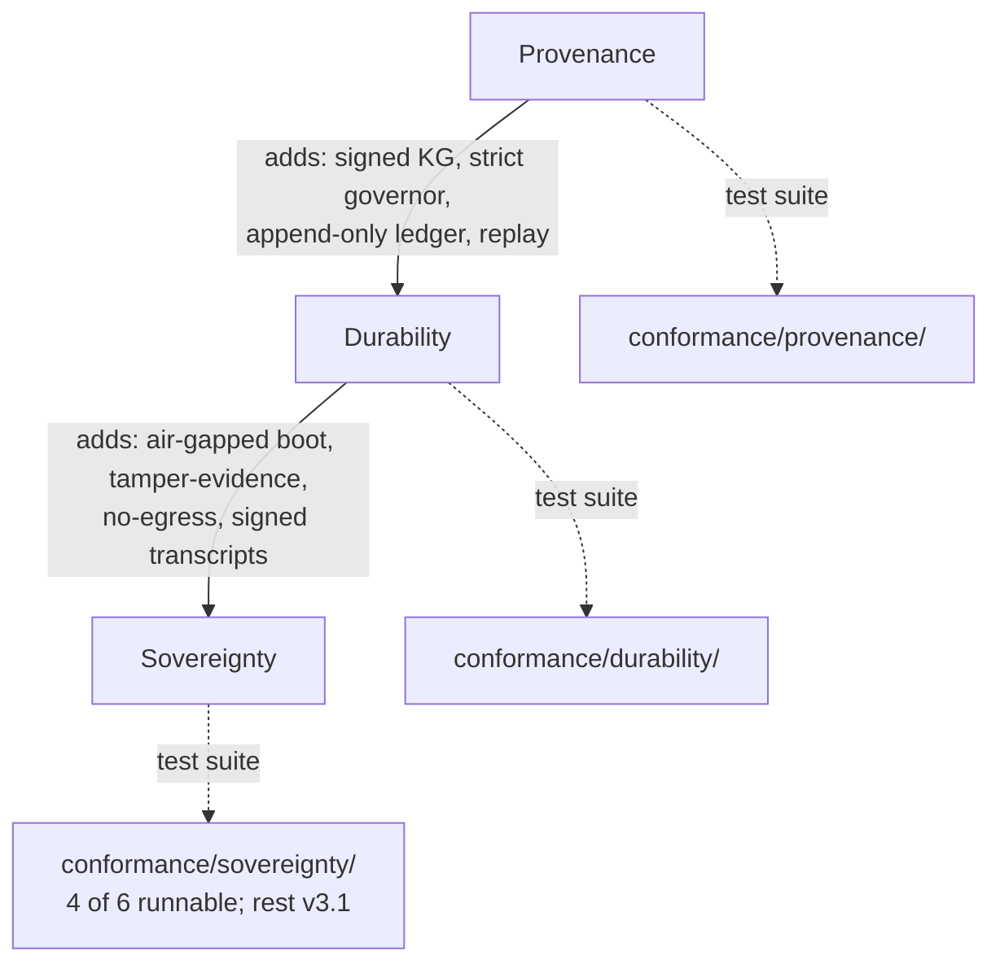

# Architecture

SKI v3 is built around a **two-phase architecture**. Phase 1 (offline,
probabilistic) compiles regulations into a signed v3 Knowledge Graph
(typed obligations, jurisdictional scope, effective-date intervals,
precedent edges). Phase 2 (runtime) evaluates telemetry against that
graph via a KG-grounded local LLM whose formalizable assertions are
mechanically cross-checked by the Symbolic Verifier — all inside the
operator's sovereignty boundary. The
[v3 specification](specification-v3.md) and
[RFC 0002](RFCs/0002-v3-neuro-symbolic-pivot.md) are the normative
references; this page is the orientation map.

## High-level dataflow

```mermaid
flowchart LR
    subgraph P1["Phase 1 — Compilation (outside sovereign boundary)"]
        Reg[Regulatory<br/>documents]
        Ext[kg-extractor<br/><i>(LLM-assisted)</i>]
        Val[kg-validator<br/><i>(human review)</i>]
        KG[(Signed v3<br/>Knowledge Graph)]
        Reg --> Ext --> Val --> KG
    end

    subgraph P2["Phase 2 — Runtime (inside sovereign boundary)"]
        Tel[Telemetry<br/><i>(SCADA, sensors, ETL)</i>]
        SC[Sidecar]
        SM[SKI Model service]
        SCOPE[KG scoping<br/><i>jurisdiction + effective date</i>]
        LL[LLM Evaluator<br/><i>local, T=0, structured<br/>generation (Ollama)</i>]
        SV[Symbolic Verifier<br/><i>independent check of<br/>formalizable assertions</i>]
        RTG{{Risk-Tier Governor}}
        AM{{Agreement monitor}}
        TB[(Telemetry buffer)]
        AL[(Audit ledger<br/><i>signed transcript +<br/>envelope</i>)]
        V((Verdict envelope))

        Tel --> SC --> SM
        SM --> SCOPE --> LL --> V
        LL --> SV --> V
        SM --> RTG --> V
        SV --> AM
        SM --> TB
        V --> AL
    end

    KG -. one-way<br/>signed transfer .-> SM

    classDef boundary fill:#f9f9f9,stroke:#666,stroke-dasharray: 5 5;
    class P1,P2 boundary;
```

The dashed arrow is the **only** thing that crosses the boundary: a
signed KG file. No operational data ever moves the other way.

## Component breakdown

### Phase 1 — Compilation

#### kg-extractor

Reads regulatory documents and emits structured rule candidates. Uses
an LLM backend (configurable — not bound to any vendor). Output is
**never** trusted directly; every rule is reviewed in the next step.

#### kg-validator

Human-in-the-loop validation of the v3 typed graph: schema validation
against the closed obligation enumeration (spec §3.3) plus the §3.6
referential-integrity passes (every edge endpoint resolves, every
obligation carries a citation and jurisdiction scope). No
auto-approval.

#### Knowledge Graph

The compiled artifact — a typed graph, not a rule list:



The runtime refuses to load an unsigned KG (Ed25519; see
[ski-model-deploy](https://github.com/kpifinity/ski-framework/tree/main/tools/ski-model-deploy)).
See [Knowledge Graph schema](knowledge-graph.md) for the full shape.

### Phase 2 — Runtime

#### Sidecar

Passive, read-only telemetry intake. Reads from `file`, `http`, or
`kafka` (selected via `TELEMETRY_SOURCE`). Forwards normalised records
to the SKI Model service over mTLS. Rejects any incoming record that
carries a `rule_id` field — producers must not pre-route.

#### SKI Model service

The runtime's core. For every telemetry record:



Key invariants:

- **One worker.** `SKI_MODEL_WORKERS=1` is enforced. Concurrent writes
  to the buffer + ledger would break the sequence-number monotonicity
  guarantee. See [`docs/CONCURRENCY.md`](https://github.com/kpifinity/ski-framework/blob/main/reference-implementation/docs/CONCURRENCY.md).
- **Buffer-before-evaluate.** The current record is written to the
  buffer **before** evaluation, so self-referential window queries see
  the record they're being asked about.
- **Authoritative clock.** The telemetry's `timestamp` is the "now"
  for stateful predicates and effective-date scoping. Wall-clock at
  arrival is never consulted.
- **Disagreement is a signal, not an error.** A verifier status other
  than `AGREED` is recorded in the envelope and feeds the agreement
  monitor; it never silently overrides or is overridden.

#### Symbolic Verifier

Mechanically re-evaluates every formalizable assertion the LLM emits,
against the same telemetry. Stateless predicates
(`must_not_exceed`, `must_be_at_least`, `must_be_within`,
`must_equal`, `must_not_equal`) plus stateful window predicates
(`window_count`, `window_sum`, `window_avg`) backed by the telemetry
buffer. Assertions outside the formalizable subset are reported
`UNVERIFIABLE` — honestly, not silently.

#### Agreement monitor

A rolling window over verifier statuses;
`agreement_rate = AGREED / total`. `/api/canary` (name kept from v2
for operator continuity) returns the snapshot; a sustained drop below
the threshold (default 0.95) is the page-someone signal. Replaces the
v2 determinism canary.

#### Risk-Tier Governor

Tier is declared per rule **in the KG** (spec §5.4); the caller cannot
self-declare. The strictest tier across the applicable obligations
wins.

#### Telemetry buffer

Postgres-backed, RANGE-partitioned by `telemetry_ts`. Append-only at
the database layer (same trigger pattern as the ledger). Retention is
configured per tenant in the `tenants` table — no default; the
operator must set it explicitly. See
[RFC 0001](RFCs/0001-stateful-evaluation.md).

#### Audit ledger

Append-only Postgres table. Each v3 row carries the full provenance:

- `sequence_number` (monotonic, unique) and `entry_hash` chained to
  `previous_entry_hash`,
- `telemetry_hash` (joins to buffer rows),
- `envelope_json` + `envelope_hash` — the complete verdict envelope
  (verdict, reasoning, KG citations, assertions, verifier result,
  model provenance hashes),
- `transcript_json` + `transcript_signature` + `signing_key_id` — the
  Ed25519-signed LLM transcript,
- `verifier_status`, `knowledge_graph_version`, `schema_version`,
  `recorded_at`.

UPDATE / DELETE / TRUNCATE are blocked by triggers. The canonical
serialization is documented in `tools/audit-ledger/src/audit_ledger/canonical.py`
so any third party can re-verify.

## Conformance levels



The conformance test suite is the **executable specification**. See
[Conformance](conformance.md).

## Threat model

See [Threat model](threat-model.md) for the complete list of in-scope
threats, defences, and out-of-scope concerns.

## Related documents

- [RFC 0002 — SKI v3.0: Neuro-Symbolic Pivot](RFCs/0002-v3-neuro-symbolic-pivot.md)
- [RFC 0001 — Stateful evaluation](RFCs/0001-stateful-evaluation.md)
- [Knowledge Graph schema](knowledge-graph.md)
- [Replay primitive](replay.md)
- [Migrations](migrations.md)
- [Glossary](glossary.md)
